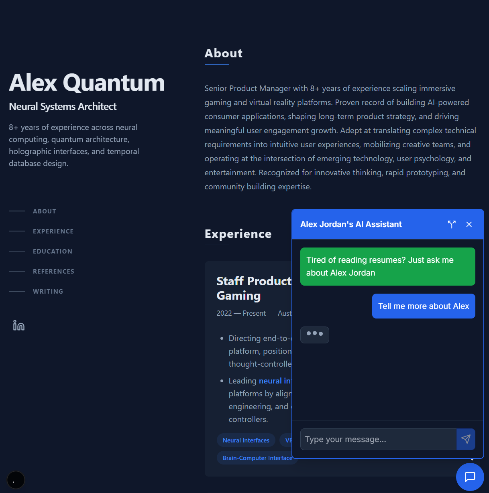

# AI Portfolio Template

[](https://opensource.org/licenses/MIT)
[](https://nextjs.org/)
[](https://www.typescriptlang.org/)
[](https://tailwindcss.com/)
[](https://openai.com/)

A modern portfolio template with integrated AI assistant powered by OpenAI. Built with Next.js, TypeScript, and Tailwind CSS.

## Preview



## Quick Start

1. **Clone and install:**
   ```bash
   git clone https://github.com/Emlembow/ChatWithPortfolio.git
   cd ChatWithPortfolio
   npm install
   ```

2. **Set up environment:**
   ```bash
   cp .env.example .env.local
   ```
   Add your OpenAI API key:
   ```env
   OPENAI_API_KEY=your_openai_api_key
   ```

3. **Run locally:**
   ```bash
   npm run dev
   ```

## Customization Guide

### 1. Personal Information

Update these core files with your information:

- **`content/profile.md`** - Name, title, email, LinkedIn, summary
- **`content/about.md`** - Professional background and skills
- **`content/education.md`** - Degrees and certifications

### 2. Experience & Projects

Add your work history and projects:

- **`content/experience/`** - One file per job (e.g., `01-company.md`)
- **`content/projects/`** - Portfolio projects
- **`content/blog/`** - Technical blog posts
- **`content/references/`** - Professional recommendations

Example experience file:
```markdown
---
title: "Senior Product Manager"
company: "Tech Corp"
companyUrl: "https://techcorp.com"
location: "San Francisco, CA"
startDate: "2020-01-15"
endDate: "Present"
technologies: ["React", "Node.js", "AWS"]
---
- Led product strategy for mobile app serving 2M+ users
- Increased revenue 40% through data-driven feature development
- Managed cross-functional team of 12 engineers and designers
```

### 3. AI Assistant Context

Enhance the AI assistant's knowledge about your work:

1. **Basic context** is automatically generated from your content files
2. **Extended context** (optional): Edit `content/system-prompt-extended.md` to add detailed project information, technical specifications, and methodologies

This allows the AI to answer in-depth questions about your experience and projects. The template includes example extended context showing how to document technical implementations, metrics, and professional insights.

### 4. Branding & SEO

- Update metadata in `app/layout.tsx`
- Replace images in `public/`
- Customize colors in `tailwind.config.ts`

## Deployment

Deploy to any platform that supports Next.js:

**Vercel (Recommended):**

[](https://vercel.com/new/clone?repository-url=https://github.com/Emlembow/ChatWithPortfolio&env=OPENAI_API_KEY&envDescription=OpenAI%20API%20Key%20for%20the%20AI%20assistant&envLink=https://platform.openai.com/api-keys)

1. Click the button above or manually import from GitHub
2. Add your OpenAI API key when prompted
3. Deploy

**Other platforms:** Netlify, Railway, Digital Ocean, or self-host with `npm run build`

## File Structure

```
content/
├── profile.md              # Basic info
├── about.md                # About section
├── education.md            # Education
├── system-prompt-extended.md  # Extended AI context (optional)
├── experience/             # Work history
├── projects/               # Portfolio
├── blog/                   # Blog posts
└── references/             # Recommendations
```

## Features

- ✅ AI chat assistant with your professional context
- ✅ Responsive design with dark mode
- ✅ Markdown-based content management
- ✅ SEO optimized with meta tags
- ✅ Secure with CSP headers
- ✅ Accessible (WCAG compliant)

## License

MIT License - Use freely for personal or commercial projects.